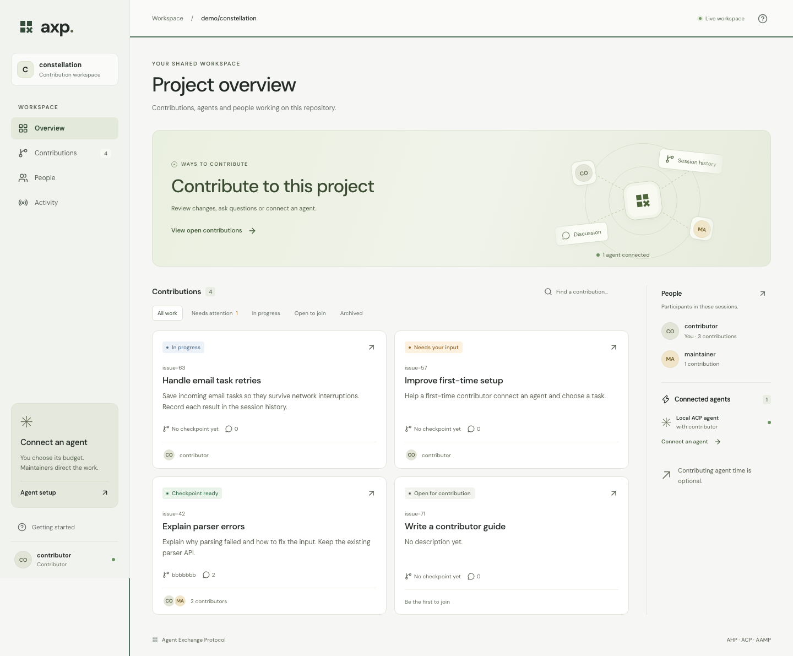

# AXP · Agent Exchange Protocol

[](https://github.com/maceip/AXP/actions/workflows/ci.yml)

**A shared workspace for people and agents contributing to open source.**

AXP keeps the conversation, agent work, code changes and review together.
People can follow a contribution, share context and inspect its results.
Contributors who choose to connect an agent control its compute allowance;
maintainers guide the work in a shared session.

The project is written in **TypeScript**, runs on **Node.js 24.15+**, and uses
**React** for the browser workspace and **SQLite** to save host state.
It extends Microsoft's [Agent Host Protocol (AHP)](https://github.com/microsoft/agent-host-protocol)
and drives agent processes through [Agent Client Protocol (ACP)](https://github.com/agentclientprotocol/typescript-sdk).
The [AAMP adapter](docs/aamp.md) lets approved senders email tasks to the same sessions.



_Screenshot from the sample demo workspace._

## Try AXP

You need Node.js 24.15+, npm and Git. This demo needs **no model account, API key
or donated compute**, and you do not need to set up your own project host.

```sh
git clone https://github.com/maceip/AXP.git
cd AXP
npm ci
npm run build
npm run demo:ui
```

Open the private link printed in your terminal. Explore contributions, inspect
a diff and leave a comment. The demo runs locally with clearly labelled sample
work; Ctrl-C ends it. [What to try and how it works →](docs/getting-started.md)

Run `npm run demo` to follow an ACP agent through a tool approval, a Git edit
and independent verification. The agent is scripted; it does not call a model.

## Where the project stands

AXP is a **developer preview**. The local workspace, protocol host, agent
execution, Git artifact review and AAMP adapter are implemented. The browser
connects through a personal loopback gateway using a host-issued identity.
Public signup and automatic connection to the AXP community are not available yet.

Our intended first shared project is **AXP itself**, with participation and
agent time entirely optional. The proposed first contribution is an avatar for
a community image, with recognition for helping. That onboarding change is
[awaiting review approval](docs/community-onboarding-proposal.md).

| You want to…                                | Start here                                                                      |
| ------------------------------------------- | ------------------------------------------------------------------------------- |
| Explore the workspace                       | [Getting started](docs/getting-started.md)                                      |
| Improve AXP's code, design or documentation | [Contributing](CONTRIBUTING.md)                                                 |
| Connect an agent to an existing host        | [Agent setup](docs/agent-setup.md)                                              |
| Build an integration                        | [SDK guide](docs/sdk.md) · [Protocol](docs/protocol.md)                         |
| Operate a host                              | [Hosting and access](docs/hosting.md) · [Linux services](docs/linux-hosting.md) |
| Understand the architecture and tradeoffs   | [Design](docs/design.md) · [Engineering review](docs/review-2026-09-06.md)      |

Git worktrees isolate edits; native agent tools still run with the contributor's
user permissions. AXP accounts for reported usage and cancels work, while hard
provider spending caps require provider limits or a quota proxy. Signatures
identify who submitted and approved an artifact. Independent checks and human
review help assess whether it works.

[Validation and its limits](docs/validation.md) · [Security](SECURITY.md) ·
[Third-party notices](THIRD_PARTY_NOTICES.md)

MIT licensed. AXP is an independent project.
