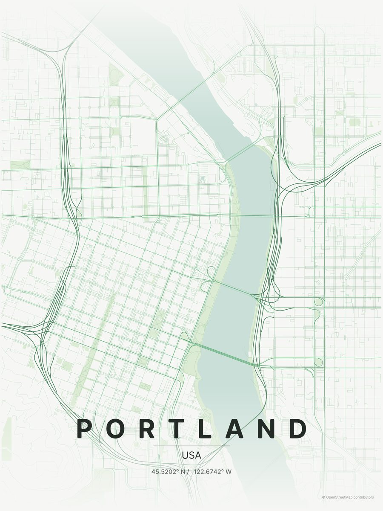
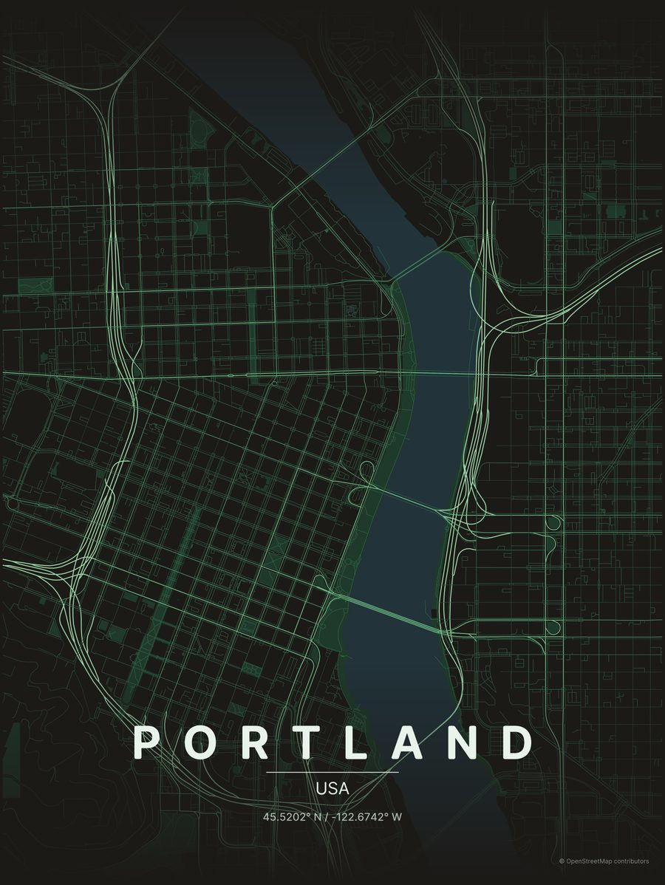

# Posters

Two renders from the vendored MapToPoster pipeline (`tools/poster`) with the
placeholder AXP themes and AXP Runde as the display face:

| Outdoor (day)                                      | Indoor (night)                                   |
| -------------------------------------------------- | ------------------------------------------------ |
|  |  |

What is decided: the pipeline, the font hook, and where themes live. What is
not: the palettes. They are lifted from today's workspace tokens and will be
redone when the design language is locked. The theme schema is eleven
colours (background, text, water, parks, five road tiers, gradient), so
re-theming is a five-minute job once the greens are final.

Ideas for when that happens:

- A leaf-green gradient fade instead of upstream's top/bottom fade to the
  background colour, so posters share Liquid Leaf's meniscus.
- The hooked `l` from AXP Runde is already in the city name; the coordinates
  line could use tabular figures.
- A third theme for the "paper" surfaces in Grove (warm parchment, sand
  roads) for printed material.
